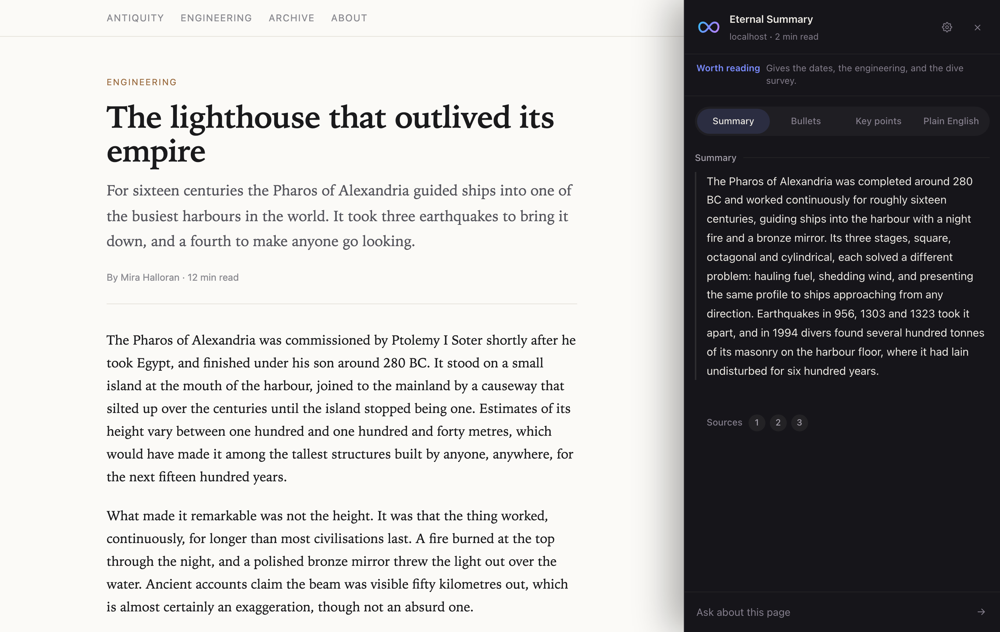
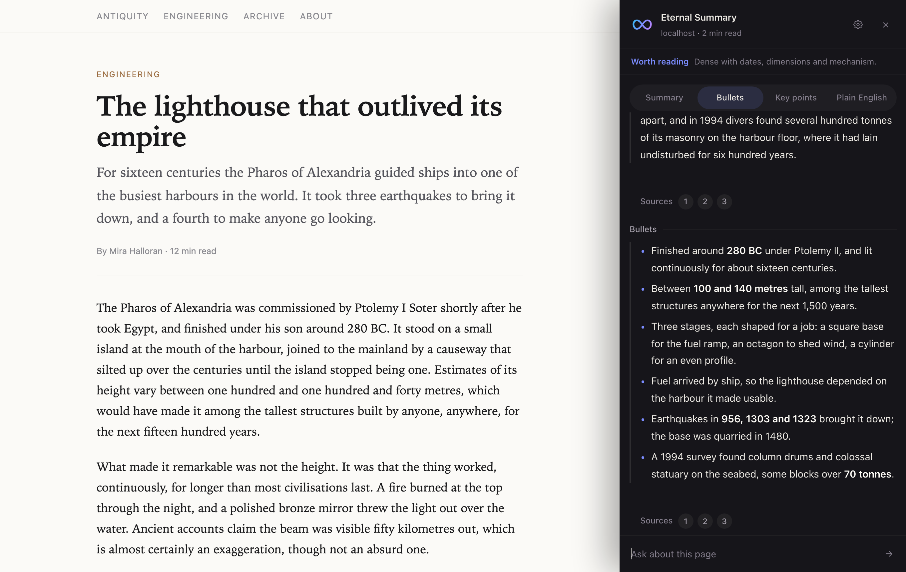
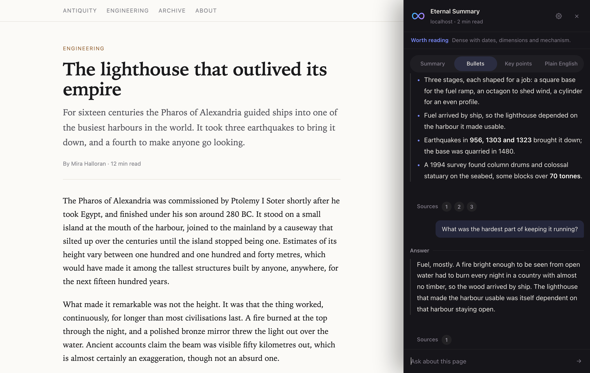
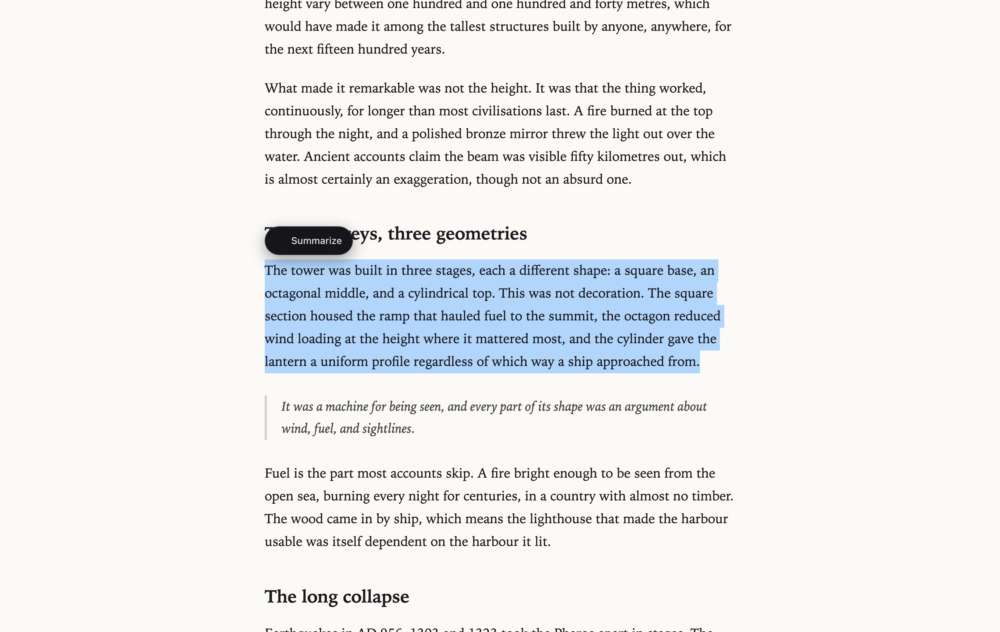
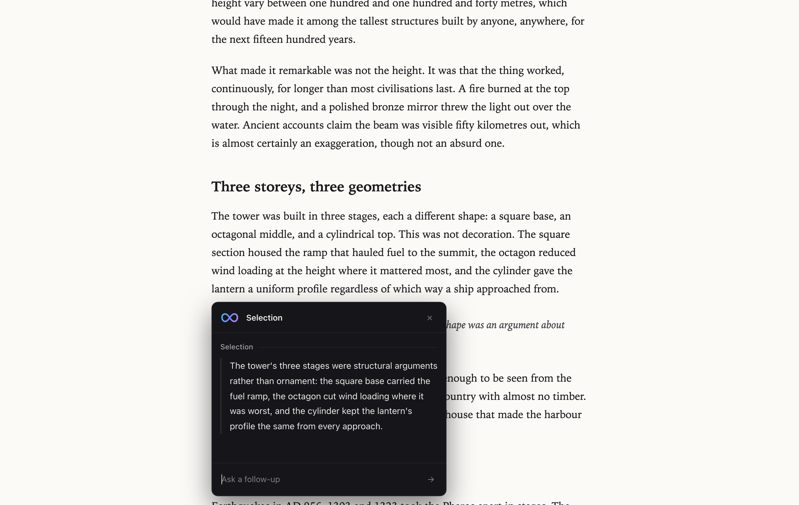

# Eternal Summary

[](https://github.com/Alitleis123/Eternal-Summary/actions/workflows/ci.yml)

A Chrome extension that summarizes the page you are reading, explains anything you highlight, and answers follow-up questions without leaving the tab.

Live site: https://alitleis123.github.io/Eternal-Summary/



## Features

- **Page summaries.** Click the toolbar icon or press the shortcut and the extension reads the page and returns a summary.
- **Four modes.** Summary, bullets, key points, or plain English. Switching modes re-reads the page in that style and appends the result, so the conversation above it stays intact. Your choice is remembered for next time.
- **Selection summaries.** Highlight text and a floating Summarize button appears next to it. The card that opens follows the highlight as you scroll.
- **Follow-up questions.** Ask anything about the page in the same panel. The thread scrolls on its own, keeps every turn, and only follows new messages when you are already at the bottom.
- **Clickable sources.** Every answer lists the passages it drew on. Clicking one closes the panel and highlights that passage on the page.
- **Local caching.** Summaries are kept in extension storage for thirty minutes, so reopening a page you already read costs nothing.
- **Reading time.** The header shows how long the page would take to read, so you can see what the summary saved you.

## Screenshots

| Bullets mode | Follow-up questions |
| --- | --- |
|  |  |

| Highlight a passage | Summarize just that passage |
| --- | --- |
|  |  |

## Keyboard shortcut

`Cmd+Shift+S` on macOS, `Ctrl+Shift+S` elsewhere. `Esc` or a click outside closes the panel. Reassign it at `chrome://extensions/shortcuts`.

## Install

1. Clone the repository:
   ```bash
   git clone https://github.com/Alitleis123/Eternal-Summary.git
   ```
2. Open `chrome://extensions` and turn on **Developer mode**.
3. Click **Load unpacked** and select the cloned folder.

The extension talks to a hosted backend by default, so there is nothing else to configure. Works in Chrome, Brave, Edge, and other Chromium browsers.

## Running your own backend

The backend is a small Express service that proxies requests to the Gemini API. Run it if you would rather not use the hosted one.

```bash
cd backend
npm install
cp .env.example .env       # then put your Gemini API key in it
npm start                  # listens on port 3000
```

Deploying to Fly.io:

```bash
fly launch                                  # first time only
fly secrets set GEMINI_API_KEY=your_key_here
fly deploy
```

Fly injects secrets as environment variables at runtime, and `.env` is excluded from the image by `.dockerignore`, so the key never ships in a build.

`GEMINI_API_KEY` is required. Without it the server still starts and serves `/healthz`, but every summarize and ask request fails with a clear message in the logs.

To point the extension at your own deployment, change `API_BASE` in `background.js` and the matching entry in `host_permissions` in `manifest.json`.

### Endpoints

| Method | Path | Body | Returns |
| --- | --- | --- | --- |
| `GET` | `/healthz` | | `ok` |
| `POST` | `/api/summarize` | `{ text, mode }` | `{ summary, sources }` |
| `POST` | `/api/ask` | `{ text, messages, selection }` | `{ answer, sources }` |

`mode` is one of `tldr`, `bullets`, `key-points`, or `simple`. Both endpoints are rate limited to 30 requests per minute per IP.

## Tests

Real Chrome, driven over the DevTools Protocol. Only the `chrome.*` API surface and the network are stubbed, so the tests exercise the actual message path: the page posts to `listener.js`, which forwards to `background.js`, which calls the backend.

```bash
npm test      # 34 end-to-end tests
npm run check # syntax check every entry point
```

The fixture page ships deliberately hostile CSS (`* { line-height: 1 !important }`, uppercase buttons, forced letter spacing) to prove the UI stays isolated. Coverage includes style isolation, markdown rendering, cache expiry and mode persistence, source lookup and highlight cleanup, focus trapping, error and rate-limit paths, and a check that repeated opens strand nothing on the page.

## Layout

```
Eternal-Summary/
├── manifest.json      Extension manifest (MV3)
├── background.js      Service worker. Owns the backend address and every network call.
├── listener.js        Content script. Selection button, and the bridge to the page.
├── content.js         The panel itself. Runs in page context, injected on demand.
├── ui.css             Styles for the panel and the selection card
├── icons/             Extension icons, 16 through 512
├── test/              End-to-end tests and the CDP driver
├── backend/           Express service that calls the Gemini API
└── docs/              Project site, published with GitHub Pages
```

Page-context code never sees the backend URL. It names an endpoint, `listener.js` forwards that to the service worker, and the worker rejects anything outside its allow list before making a request.

The UI renders inside a shadow root, with `ui.css` loaded into it. Page stylesheets cannot cross that boundary, so a site rule like `* { line-height: 1 !important }` cannot collapse the panel's text, and the panel cannot leak styles onto the page either.

## Privacy

Page text is sent to the backend only when you ask for a summary or an answer. Nothing is stored server side, and summaries are cached only in your own browser. See [Privacy.md](Privacy.md).

## License

Eternal Summary License, copyright 2025 Ali Tleis. See [LICENSE](LICENSE). You may not redistribute, modify for public use, or use this project commercially without permission.

## Author

Ali Tleis, Computer Science at Northeastern University. [GitHub](https://github.com/Alitleis123)
